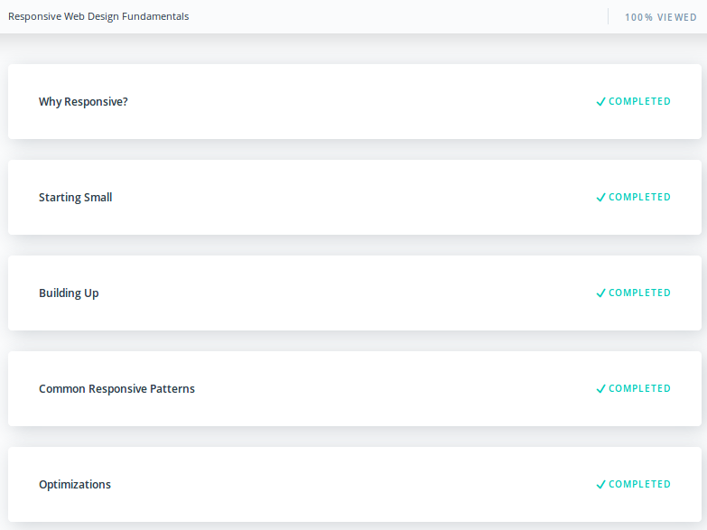
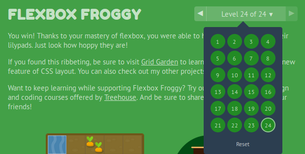
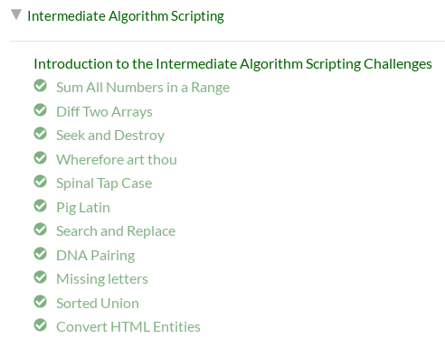

# kottans-frontend

> Programming - it's difficult and interesting simultaneously. For learning you must be self-organized and getting a good materials. I'm pleasantly impressed with the structure of tasks.

## Stage 0. Self-Study
 - [x] [Completed](self_study/self_study.md)

## General Basics
 - [x] 0. [Git Basics](git-and-github/git-and-github.md)
 - [x] 1. [Linux CLI and Networking](task_linux_cli/linux-cli.md)
 - [x] 2. [GitHub and Collaboration](task_git_collaboration/git-collaboration.md)
## Front-End Basics
 - [x] 3. [Intro to HTML and CSS](task_git_html_css_intro/html-css.md) 

## Responsive Web Design
1. [x] Udacity [Responsive Web Design Fundamentals](https://www.udacity.com/course/responsive-web-design-fundamentals--ud893)

2. [x] [Flexbox Froggy](http://flexboxfroggy.com/)

> It was wonderful. I reminded myself of the basic css rules for build responsive pages. CSS Grid layout and Flexbox - powerfull conception for design web pages.

## JS Basics
1. [x] Udacity [Intro to JS](https://www.udacity.com/course/intro-to-javascript--ud803)

2. [x] freeCodeCamp [Algorithm Scripting Challenges](https://learn.freecodecamp.org/javascript-algorithms-and-data-structures/intermediate-algorithm-scripting/)

